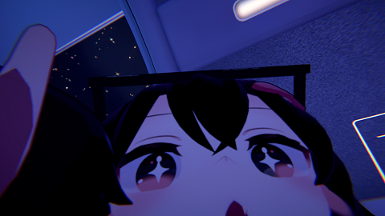
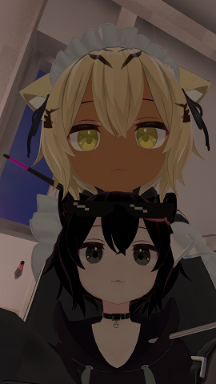

# *Hi. I'm Mutsuki.*
## 👋 I am active in Discord. 
I am a developer and security researcher as a hobby. 
I also use Python, Javascript, Golang, etc. to build the things I like. 

### 😎 GitHub Stats

 

## 🚀 The languages I can use are:

  
  
  

- [x] TS/JS little bit
- [x] Japanese
- [ ] English, en_US

## 😲 The tools I use are:

</a>

## 😋 How to Contact me:

## 👍 Here are some other hobbies:

💕 Anime

### Anilist

### Favorite anime genre
- Yuri
- Fantasy
- Adventure
- Action
- Slice of Life

💕 VRChat

❤ If you can speak Japanese, <a href="https://vrchat.com/home/user/usr_681aff0a-fb12-4f9a-a58a-02fc23f083e4">please join me</a>! ❤ 
 
 
 
 

✨ Games
  

- Genshin Impact
- Taiko no Tatsujin
- Princess Connect! Re:Dive
- 3DS - ACNL, YW, YW2, YW3 etc..
- And more! 

🤓 Gadgets

### Host "main-desktop"
- CPU: Intel Core i7-9700
- MEM: DDR4 3200MHz 32GB
- GPU: GeForce RTX 3060Ti 8GB
- SSD1: SATA SSD 480GB(Windows10 Enterprise LTSC 2021)
- SSD2: SATA SSD 480GB(For Genshin game data only)
- HDD1: SATA 6Gb 2TB(data drive)
- HDD2: SATA 6Gb 500GB(Symbolic links to some ProgramFiles)

### Host "sub-desktop"
- CPU: Intel Core i7-6700k
- MEM: DDR4 2133MHz 16GB
- GPU: GeForce GTX 960 2GB
- SSD1: SATA SSD 480GB(Windows10 Enterprise LTSC 2021)
- HDD1: SATA 6Gb 1TB(data drive)

### Host "media-notebook"
- CPU: Intel i5-4310M (4) @ 3.400GHz
- MEM: DDR3L 8GB
- GPU: Intel 4th Gen Core Processor
- SSD1: SATA SSD 240GB
- Memo: It's a NAT router for Wi-Fi to Wired, and I play media like Spotify and YouTube.

### Smartphones
- Google Pixel 6a
- OnePlus 11 5G
- etc..

🎧 Music

### Now Playing on Spotify 

